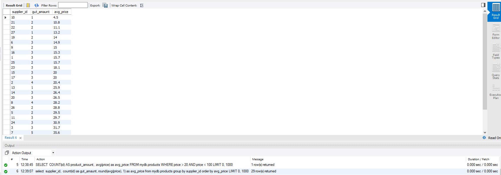

# Домашнє завдання до Теми 3. Завантаження даних та основи SQL. DQL команди 

## 1. Вибірка всіх стовпців та конкретних стовпців

### 1.1 Вибрати всі стовпчики з таблиці `products`:

```sql
select * from mydb.products;
```


### 1.2 Вибрати тільки стовпчики name і phone з таблиці `shippers`:
```sql
select name, phone from mydb.shippers;
```


## 2. Знаходження середнього, максимального та мінімального значень

### Команда, щоб знайти середнє, максимальне та мінімальне значення стовпчика `price` у таблиці `products`:
```sql
select 
	round(avg(price), 1) as avg_price, 
	max(price) as max_price,
	min(price) as min_price
from mydb.products;
```


## 3. Обрання унікальних значень та сортування

### Команда, щоб обрати унікальні значення колонок `category_id` та price з таблиці `products`, упорядкувавши їх за спаданням значення `price`. Обрання тільки перші 10 рядків:
```sql
select distinct 
	category_id as unique_id, 
	price as unique_price
from mydb.products
order by price
limit 10;
```

	
## 4. Підрахунок продуктів у ціновому діапазоні
### SQL команда, щоб знайти кількість продуктів (рядків) з таблиці `products`, які знаходяться в цінових межах від 20 до 100:
```sql
SELECT 
	COUNT(id) AS product_amount, 
	avg(price) as avg_price
FROM mydb.products
WHERE price > 20 AND price < 100;
```


## 5. Кількість продуктів та середня ціна за постачальником
### SQL команда, щоб знайти кількість продуктів та середню ціну (`price`) для кожного постачальника (`supplier_id`):

```sql
select 
	supplier_id, 
	count(id) as gut_amaunt,
	round(avg(price), 1) as avg_price
from mydb.products
group by supplier_id
order by avg_price;
```

